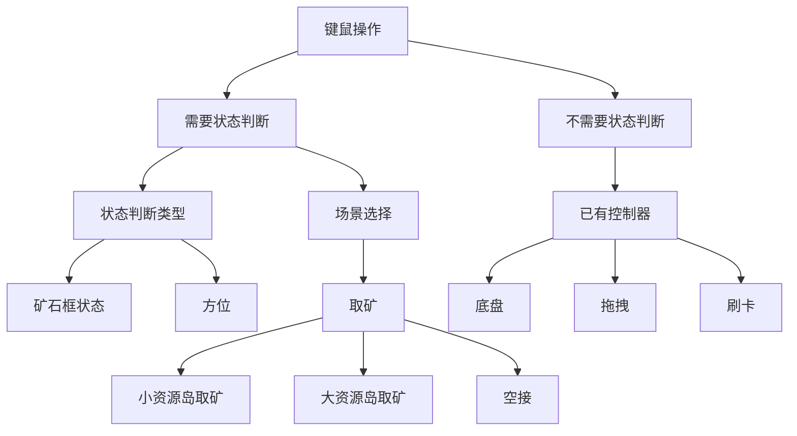
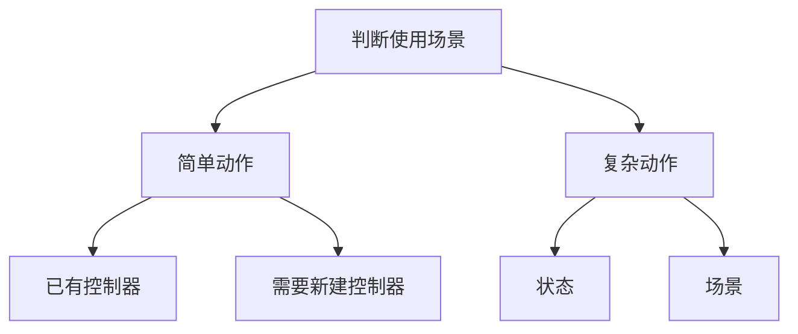

# rm_manual

> ## 作用简述
>
> 实现了键鼠(PC)和遥控器(RC)操作机器人
>
> 调用rm_control/common/commandsender实现改变控制器模式
>
> date.h,input_event.h用来和裁判系统交互，收到机器人的血量，类型等信息，发送ui

## include

### rm_manual

#### common

###### manual_base.h

定义了

- PASSIVE
- IDLE
- RC
  - remote controller
  - 左右上方拨杆的三个档位
- PC


###### data.h

订阅了（然后通过一系列回调函数获取值）

- joint_state
- 伺服电机
- dbus
- 云台错误信息
- 坐标系

发布了

- 裁判系统

- 超级电容（给裁判系统）

- ```
   initSerial（）（初始化串口？）
  ```


###### input_event.h

定义

- 上升沿
- 下降沿
- 持续按下******

```c
void update(bool state)
{
  if (state != last_state_)
  {
    if (state && rising_handler_)
      rising_handler_();
    else if (!state && falling_handler_)
      falling_handler_();
    last_state_ = state;
    last_change_ = ros::Time::now();
  }
  if (state && active_high_handler_)
    active_high_handler_(ros::Time::now() - last_change_);
  if (!state && active_low_handler_)
    active_low_handler_(ros::Time::now() - last_change_);
}
```

#### referee

###### engineer_manual.h

- 键盘扫描
- 遥控数据读取
- PC数据读取
- 发送命令 sendCommand(time)
- 画UI
- 伺服控制器？

```
void updateServo();
```

- 关闭遥控
- 开启底盘输出

```
void chassisOutputOn() override;
```

- 遥控右上方三个档位
- 遥控左上方最高档
  - 机械臂测试，校准？
- action控制回调
  - middleware操作模式
- 各个按键
  - 执行响应动作组
  - 画UI


### 按键注释

```c++
void ctrlQPress();         // choose "left_" situation // "has_stone_" // "sky"
void ctrlWPress();         // choose "mid_" situation // "no_stone_"
void ctrlEPress();         // choose "right_" situation //  ""
void ctrlRPress();         // choose "ready_" situation

void ctrlAPress();         // choose "sky" situation
void ctrlSPress();         // choose "grasp" situation
void ctrlDPress();         // choose "exchange" situation

void ctrlFPress();         // execute next
void ctrlGPress();         // execute repeat

void ctrlZPress();         // choose "store" situation
void ctrlXPress();         // choose "_gain" situation
void ctrlCPress();         // cancel and delete scence
void ctrlBPress();         // choose "ground_stone" situation

void shiftPressing();      // low speed
void shiftRelease();       // low speed

void shiftQPress();        // servo's angular z
void shiftQRelease();      // servo's angular z
void shiftEPress();        // servo's angular z
void shiftERelease();      // servo's angular z

void fPress();             // enter gimbal rate
void fRelease();           // exit gimbal rate
void shiftZPress();        // gimbal toward 1
void shiftXPress();        // gimbal toward 2
void shiftCPress();        // gimbal toward 3
void shiftVPress();        // gimbal toward 4

void rPress();             // calibration

void zPress();             // card long
void xPress();             // card short

void cPress();             // drag

void vPress();             // change mode servo

void gPress();             // gripper
void gRelease();           // gripper

void mouseLeftRelease();   // execute next
void mouseRightRelease();  // execute repeat
```


### 模式注解

```c
enum
{
    //operating_mode_
  MANUAL,
  MIDDLEWARE
};
enum
{
    //servo_mode_
  SERVO,
  JOINT
};
enum
{
    //gimbal_mode_ 
  RATE,
  DIRECT
};
```

## launch

### load.launch

- 加载rm_config中对应机器人类型的控制器
- 运行rm_mannul节点？（没找到）

## src

### common

#### manual_base.cpp

run()

- 和裁判系统交互
- 发布命令
- 画UI


### referee

#### engineer_manual.cpp

三种按键模式

- 按下
- 松开
- 持续按下


```c
void EngineerManual::checkKeyboard()
```

在键盘扫描中包含所有的按键EVENT的update函数（内容见input_event.h）


```c
void EngineerManual::updateRc()
```

先检查左拨杆的状态

然后就读DBUS数据再判断进入GYRO或者FOLLOW

遥控器数据

```c
DbusData_()
    摇杆
  : ch_l_x(0.0)
  , ch_l_y(0.0)
  , ch_r_x(0.0)
  , ch_r_y(0.0)
      轮子
  , wheel(0.0)
      拨杆
  , s_l(0)
  , s_r(0)
```


```c
void EngineerManual::updatePc()
```

轮询键盘


```c
void EngineerManual::sendCommand(const ros::Time& time)
{
  if (operating_mode_ == MANUAL)
```

判断operating_mode_ 模式然后对应发送命令


```c
void EngineerManual::updateServo()
```


# 新增动作

遥控器

- 在engineer_manual.h中新加一个InputEvent对象（遥控器对象在manual_base.h中都有声明了因为所有兵种通用）
- 在manual_base.cpp中updateRc中加入对应按键的update
- 在engineer_manual.cpp中构造函数里

```c
left_switch_down_event_.setFalling(boost::bind(&EngineerManual::leftSwitchDownFall, this));
```

- 在engineer_manual.cpp中updateRc中


## 现有的键位逻辑




## 新增键位逻辑




机械臂简单动作

```c
void EngineerManual::ctrlBPress()
{
  root_num_ = 3;
  root_ = "HOME";
  judgeRoot();
  trigger_change_ui_->update("step", prefix_ + root_);
  ROS_INFO("%s", (prefix_ + root_).c_str());
}
```

### 示例

新增前方和后方的发送A4传单

思路

- 考虑prefix_ + root_，确定按键为ctrl M

- 在rviz中测试好joint值

- 在step_list里写好动作，并分好状态

  - ```
    FT_GIVE_A4
    ```

  - ```c
    BK_GIVE_A4
    ```

​			这里的root_即为GIVE_A4, prefix_分为BK和FT

- 在rm_msgs/DbusDate.msg中添加key_m布尔

- 在rm_msgs/DbusDate.h中添加key_m的类然后加入构造函数

- 在engineer_manual.h
  - 创建输入事件的类
  - 声明按键函数
- 在engineer_manual.cpp
  - 构造函数里设定按键触发条件
  - 在键盘扫描中加入事件
  - 完善头文件中的函数声明
    - 设定root_num_ 	
      - root_num_分组逻辑
        - 一个num对应一个场景
    - 设定prefix_num_
      - prefix_num_分组逻辑：
        - 一个case对应一个按键
          - 一个case对应不同的root_num_ 有不同的解释
- 最后分别从先加入场景和先加入状态验证一遍。

## 前缀分组

- 左中右 小资源岛
- 空接，普通  大资源岛

## 后缀分组

- 小资源岛
- 大资源岛
- 拖拽

## 动作键位分配

#### 总共14个字母键，两个功能键，两个鼠标键，遥控器两个拨杆两个摇杆一个滚轮

| 字母 | 功能                       | 字母 | 功能 | 字母 | 功能                      | 字母 | 功能                       | 字母 | 功能                        |
| ---- | -------------------------- | ---- | ---- | ---- | ------------------------- | ---- | -------------------------- | ---- | --------------------------- |
| Q    | 左转                       | W    | 前   | E    | 右转                      | R    |                            |      |                             |
| A    | 左                         | S    | 后   | D    | 右                        | F    | 翻转升（按下作用松开停）   | G    | 翻转降（按下作用松开停）    |
| Z    | server z（按下作用松开停） | X    |      | C    | serverz（按下作用松开停） | V    | 翻转ROLL（按下作用松开停） | B    | 翻转PITCH（按下作用松开停） |

### +ctrl

| 字母 | 功能            | 字母 | 功能                                            | 字母 | 功能                                                         | 字母 | 功能                     | 字母 | 功能                                             |
| ---- | --------------- | ---- | ----------------------------------------------- | ---- | ------------------------------------------------------------ | ---- | ------------------------ | ---- | ------------------------------------------------ |
| Q    | 左_小资源岛取矿 | W    | 大资源岛空接                                    | E    | 右_小资源岛取矿                                              | R    | 校准                     |      |                                                  |
| A    | 小资源岛取矿    | S    | 大资源岛取矿（中间）                            | D    | 取地面矿石（拖拽会在微抬状态）                               | F    | 兑换预备姿势（方便伺服） | G    | 存矿（不需要考虑自身矿石数量）                   |
| Z    | 拖拽RISE(最上)  | X    | 拖拽,微抬（用于抬障碍快）和平放（按下切换状态） | C    | 取消下一个动作（如果STEP的UI显示的动作和自己想做的动作不一样就按） | V    | 吸盘（按下切换状态）     | B    | 机械臂做完动作HOME状态（不需要考虑自身矿石数量） |

### +shift（静步/取消/云台）

| 字母 | 功能     | 字母 | 功能                                                         | 字母 | 功能             | 字母 | 功能                                                         | 字母 | 功能                           |
| ---- | -------- | ---- | ------------------------------------------------------------ | ---- | ---------------- | ---- | ------------------------------------------------------------ | ---- | ------------------------------ |
| Q    | 慢左转   | W    | 慢前                                                         | E    | 慢右转           | R    | 云台大资源岛空接（空接时候用）（==UI说明：中间的黄色矿是空接矿==） |      |                                |
| A    | 慢左     | S    | 慢后                                                         | D    | 慢右             | F    |                                                              | G    | 取矿（不需要考虑自身矿石数量） |
| Z    | 云台翻转 | X    | 云台地面（在大资源岛和地面矿时候用）（==UI说明：大的梯形是地面矿，中间小梯形是大资源岛矿==） | C    | 进入退出伺服模式 | V    | 云台随鼠标动                                                 | B    | 云台反转（回家时候用）         |

## 执行

```c
void EngineerManual::mouseLeftRelease()
{
  root_ += "0";
  runStepQueue(prefix_ + root_);
  trigger_change_ui_->update("step", "Finished " + prefix_ + root_);
  ROS_INFO("Finished %s", (prefix_ + root_).c_str());
}
```

左键按下松开执行动作

```c
runStepQueue(prefix_ + root_);
```


# referee

### 增加新的UI

文件层级关系

- data.h 定义数据不要管
  - graph.h 真正用来和串口交互，画图的地方
    - ui_base.h 
    - 调用graph里的东西注意mode
    - add() 加载图像数据
    - display() update数据
      - flash_ui.h time_change_ui.h trigger_change_ui.h  


### 工程需要的UI内容

- 当前动作的名字
- 矿石数量
- 对应动作的辅助线
  - 空接
    - 两竖两横线
  - 大资源岛
    - 两竖两横线
  - 小资源岛
    - 两竖两横线


#### ui_engineer.msg

unit8 stone_num

string current_step_name

###### 辅助线显示方式是啥？

从config里面拿吗？


shooterTriggerChangeUi

- updateShootCmdDate
  - display()
    - updateConfig()//set content and config
      - getShootState()//get date
    - TriggerChangeUi::display();// send ui


#### FixUi

```
ui_nh.getParam("fixed", rpc_value);
```


## 辅助线UI

> 在原有的StepTrigger里面加几个gragh储存config里面的辅助线的信息，然后判断根据stepname是否有对应的config，如果有就显示辅助线

#### 现在的画UI代码思路：

一个triggerUi类对应一个gragh类，然后再发送gragh从config里面拿到的信息

| 欠缺的东西                                                   | 解决方法1                                             | 解决方法2      |
| ------------------------------------------------------------ | ----------------------------------------------------- | -------------- |
| 现有的triggerUi类的构造函数仅对应一个gragh无法同时储存多种类型的信息 | 创建多个triggerUi类，一个类对应一个组辅助线，然后判断 | 改构造函数     |
| 现有的config仅有线，文字，矩形，椭圆，圆，弧线类型，在绘制类似梯形的多边形UI时需要多个线类型的config | 增加新的type                                          | 利用多个线类型 |

​	

| 方法                                                  | 想法                                     | 优点     | 缺点                                           |
| ----------------------------------------------------- | ---------------------------------------- | -------- | ---------------------------------------------- |
| 创建多个triggerUi类，一个类对应一个组辅助线，然后判断 | 尽量不要改变现有的格式，然后代码尽量精简 | 简单     | 如果后续有添加新的辅助线，又得加类，不方便拓展 |
| 改构造函数                                            | 在新的辅助线增加的时候方便拓展           | 方便拓展 | 得想想怎么写                                   |
| 增加新的type                                          | 方便辅助线绘制                           | 方便     | 得新加一个代码                                 |
| 利用多个线类型                                        | 快速出效果                               | 简单     | 代码很长切重复                                 |


| 选择         | 思路                                                         | 问题                                                         | 问题                   |
| ------------ | ------------------------------------------------------------ | ------------------------------------------------------------ | ---------------------- |
| 改构造函数   | 一个triggerUi类多个gragh，然后在创建时就把多个config传过去(把动作组相关的config放在最后，然后step后面的全部传过去)，搞几个函数判断名字然后display（） | 新建的triggerUi继承了triggerUi,它又继承了UiBase,构造函数不太好搞 | 传参的数量不确定，得去 |
| 增加新的type | 利用类似线类型的方法，记录多个点XY坐标，然后加一个算法，连接每一个点与其最近的两个点（好像只能画凸多边形） |                                                              |                        |

